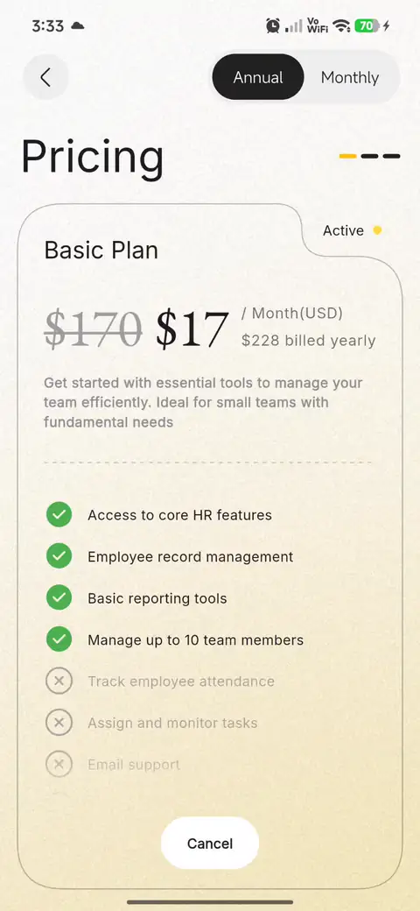

# flutter_ui_practice

A personal Flutter playground where I practice building complex screen layouts and custom UI.

## Practice Work

<table width="100%">
  <tr>
    <th width="25%">Pricing Screen</th>
    <th width="25%"></th>
    <th width="25%"></th>
    <th width="25%"></th>
  </tr>
  <tr>
    <td valign="top" align="center">
      
       
      Original design concept:
      <a href="https://dribbble.com/shots/26820665-Mobile-App-Pricing-UI-HR-Platform-Design">Mobile App Pricing UI – HR Platform Design</a>
    </td>
    <td valign="top" align="center"><i>Coming soon</i></td>
    <td valign="top" align="center"><i>Coming soon</i></td>
    <td valign="top" align="center"><i>Coming soon</i></td>
  </tr>
</table>
